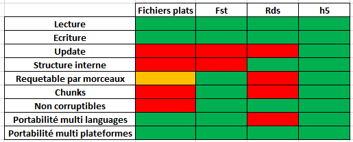
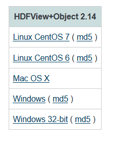
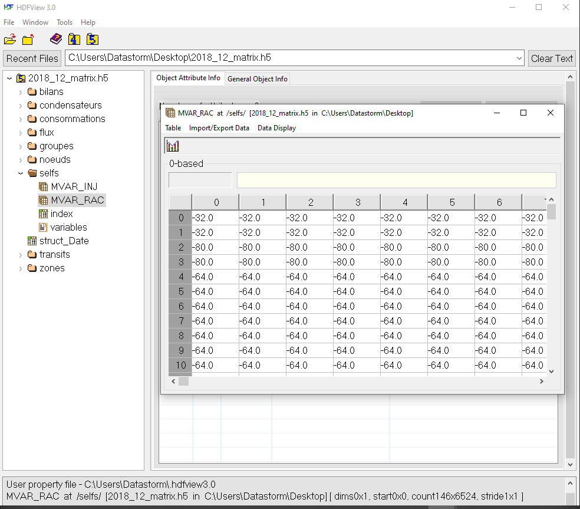
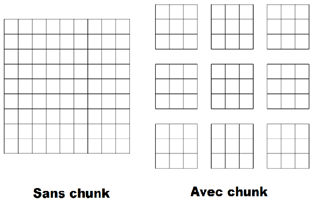
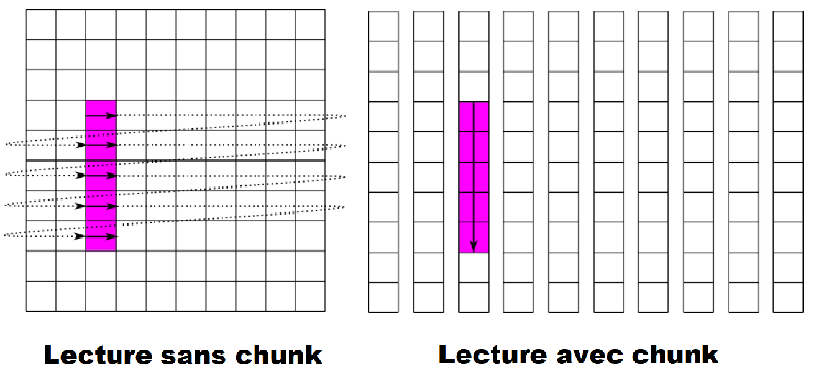

<div style="text-align:center" markdown="1">
<br><br><br><br><br><br>
<h2>Présentation hdf5</h2>
<h3>T.Robert - titouant.robert@datastorm.fr</h3>
<h3>Meetup R Addict Paris - 22/01/2020</h3>


</div>

```{r setup, include=FALSE, echo=TRUE, message=FALSE, results='hide', warning=FALSE}
library(rhdf5)
if(file.exists("myhdf5file.h5")){
  file.remove("myhdf5file.h5")
}
knitr::opts_chunk$set(echo = FALSE)
```

## Introduction au stocakge

<hr class = "hrcustom">

Il existe deux forme de stockage :

* Les fichiers textes : l'information est stockée sous forme de caractères lisibles par un éditeur de texte principalement des lettres et des chiffres (csv, txt)
* Les fichiers binaires : l'information est stockée en binaire une suite d'octets dont la valeur est comprise entre 0x00 et 0xFF (rds, h5)
  
Les fichiers binaires sont moins corruptibles, (amère expérience sur un fichier de backup en csv).

Tableau a refaire



## Présentation de HDF5

<hr class = "hrcustom">

<div class="row">
<div class="column">

* Un stockage local -> Un fichier par de base de données
* Des fichiers binaires (extension h5)
* Des fichiers structurés
* Possibilité de stocker :
    + vecteur
    + matrice
    + tenseur (tableau 3D)
* Un stockage local (pas de BDD)
* Le plus rapide que j'ai trouvé pour des tenseurs volumineux
* Utiliser par tensorflow (potentiellement beaucoups de coefficients > 10^6)
* Possibilité de compresser les données
</div>
<div class="column">

<div class = "centerdiv">

</div>


</div>
</div>

----


## h5, visualisation et structure 

<hr class = "hrcustom">

<div class="row">
<div class="column">

**HDFView** : un petit outil pour visualiser vos fichier h5.

https://support.hdfgroup.org/products/java/release/download.html#bin

<div class = "centerdiv">

</div>

* Permet une exploration rapide des fichiers
* Facile d'utilisation

</div>
<div class="column">

</div>
</div>

## Le package rhdf5

<hr class = "hrcustom">

<div class = "centerdiv">

**Disponible uniquement sur bioconductor**

Un tuto sympa : https://www.bioconductor.org/packages/release/bioc/vignettes/rhdf5/inst/doc/rhdf5.html

<hr>


### D'autres choix 

h5 **¤¤** hdf5r **¤¤**  hdfqlr

rhdf5 à l'avantage d'être bien intégré, stable (ancienneté), et maintenue à jour

<hr>

<div class="row">
<div class="column">

### Installation

```{r, eval=FALSE, include=TRUE, echo=TRUE}
install.packages("BiocManager")
BiocManager::install("rhdf5")
```

</div>
<div class="column">

### Création d'un fichier

```{r, eval=TRUE, include=TRUE, echo=TRUE, message=FALSE, results ='hide', warning=FALSE}
library(rhdf5)
h5createFile("myhdf5file.h5")
```

</div>
</div>
</div>

## Création de structure et écriture d'objets

<hr class = "hrcustom">
<div class="row">
<div class="column">

### Création de groupe / sous groupes

* Les groupes et sous-groupes servent pour structurer nos données.
* Liste récursive (comme dans **R** ou **json**)

```{r, eval=TRUE, include=TRUE, echo=TRUE, message=FALSE, results ='hide'}
h5createGroup("myhdf5file.h5","G1")
h5createGroup("myhdf5file.h5","G2")
h5createGroup("myhdf5file.h5","G1/G11")
```

### La fonction *h5ls* : visualiser sa structure.

```{r, eval=TRUE, include=TRUE, echo=TRUE, message=FALSE}
h5ls("myhdf5file.h5")
```

</div>
<div class="column">

### Ecriture d'objets

```{r, eval=TRUE, include=TRUE, echo=TRUE, message=FALSE}
V <- LETTERS # Write a vector
h5write(V, "myhdf5file.h5", "G1/V") # Write a matrix
A <- matrix(1:10, nr = 5, nc = 2) 
h5write(A, "myhdf5file.h5", "G2/A") # Write a data.frame
dfd <- data.frame(A = 1L:5L, B = seq(0, 1, length.out = 5),
                C = c("ab", "cde", "fghi", "a", "s"),
               stringsAsFactors = FALSE) 
h5write(dfd, "myhdf5file.h5", "df") # Write a tensor
tensor <- array(1:8, c(2, 2, 2)) 
h5write(tensor, "myhdf5file.h5", "tensor")
h5ls("myhdf5file.h5")
```

</div>
</div>

## Lecture d'objet

<hr class = "hrcustom">


<div class="row">
<div class="column">

### Accès avec une ouverture de connection

```{r, eval=TRUE, include=TRUE, echo=TRUE, message=FALSE}
h5f <- H5Fopen("myhdf5file.h5") #Création de la connection vers le fichier H5.
# Taille de l'objet 928 Bytes
# Accès aux objets
h5f$df ; h5f$G2$A[1:2,]
# Fermer la connection
H5Fclose(h5f)
```

Taille de **h5f** 928 bytes
Taille de **h5f$df** 1896 bytes


</div>
<div class="column">

### Accès sans ouverture de connection

```{r, eval=TRUE, include=TRUE, echo=TRUE, message=FALSE}
h5read("myhdf5file.h5", "G2/A")
```


D'un avis personnel :

* La première option est très utile dans un contexte d'exploration, **rapide** et **facile** à utiliser
* La seconde option est très utile dans une logique d'industrialisation, pas de fermeture de connection dons pas de bug en cas de platage.

</div>
</div>


## Sous-parties d'objets

<hr class = "hrcustom">

<div class="row">
<div class="column">

### Lecture
```{r, eval=TRUE, include=TRUE, echo=TRUE, message=FALSE}
h5read("myhdf5file.h5", "G2/A")
```

```{r, eval=TRUE, include=TRUE, echo=TRUE, message=FALSE}
h5read("myhdf5file.h5", "G2/A", index = list(2:3,1:2))
```

</div>
<div class="column">

### Update

```{r, eval=TRUE, include=TRUE, echo=TRUE, message=FALSE}
h5write(matrix(151:154,nr = 2,nc = 2), 
        file = "myhdf5file.h5", 
        name = "G2/A",
        start = c(2,1))
h5read("myhdf5file.h5", "G2/A")
```

</div>
</div>

## Fonctionnement des chunks

<hr class = "hrcustom">

* Permettent de lire des **sous-parties** d'objet sans le parcourir en entier
* Doivent être définis judicieusement en fonction de l'utilisation
* Augmentent le temps d'écriture, mais réduisent le temps de lecture

<div class="row">
<div class="column">

</div>
<div class="column">

</div>
</div>

## Définition des chunks : *h5createDataset*

<hr class = "hrcustom">

<div class="row">
<div class="column">


### Utilisation de l'argument chunk

```{r, eval=TRUE, include=TRUE, echo=TRUE, message=FALSE, results ='hide'}
h5createDataset(file = "myhdf5file.h5", dataset = "G1/H",dims = c(1000, 1000 , 100),
                storage.mode = "integer", chunk = c(1000, 1, 1))
arr <- array(runif(1000 * 1000 * 100), c(1000, 1000, 100))
h5write(arr , file = "myhdf5file.h5", name = "G1/H", start = c(1, 1, 1))
H5close()
```

### Performance à la lecture


```{r, eval=TRUE, include=TRUE, echo=TRUE, message=FALSE, warning=FALSE}
library(microbenchmark)
mb <- microbenchmark(h5read("myhdf5file.h5", "G1/H", index = list(1:1000, 1, 1)),
                     h5read("myhdf5file.h5", "G1/H", index = list(1, 1:1000, 1)))

```

</div>
<div class="column">

```{r, eval=TRUE, include=TRUE, echo=FALSE, message=FALSE, warning=FALSE}
library(DT)
library(ggplot2)
mb[,1] <- as.character(mb[,1])
mb[,1][which(mb[,1] == 'h5read(\"myhdf5file.h5\", \"G1/H\", index = list(1:1000, 1, 1))')] <- "Avec chunk"
mb[,1][which(mb[,1] == 'h5read(\"myhdf5file.h5\", \"G1/H\", index = list(1, 1:1000, 1))')] <- "Sans chunk"
autoplot(mb)
```


</div>
</div>

## Benchmark contre le fonction R le ples rapides

### Test en lecture force brute (matrice 10K * 10K)

<hr class = "hrcustom">

```{r, eval=TRUE, include=FALSE, echo=FALSE, message=FALSE, warning=FALSE}
library(data.table)
library(fst)
library(ggplot2)
mat <- matrix(1 : (10000 * 10000), ncol = 10000)
fwrite(mat, "mat.csv")
h5write(mat, "myhdf5file.h5", "G1/mat1", level = 0)
write.fst(data.frame(mat), "fst.fst")

mb <- microbenchmark(h5read("myhdf5file.h5", "G1/mat1"),
                     fread("mat.csv"),
                     read.fst("fst.fst"), times = 20L)
mb[,1] <- as.character(mb[,1])
mb[,1][which(mb[,1] == 'h5read(\"myhdf5file.h5\", \"G1/mat1\")')] = "h5read"
mb[,1][which(mb[,1] == 'fread(\"mat.csv\")')] = "fread"
mb[,1][which(mb[,1] == 'read.fst(\"fst.fst\")')] = "read.fst"
mb
```

```{r, eval=TRUE, include=TRUE, echo=FALSE, message=FALSE, warning=FALSE}
autoplot(mb)
```

## Conclusion

- Un système rapide
- Utilisé par tensorflow (google)
- Repond a tout les besoins 

